## Garnet Proxy — Request Timing Diagram

Paste at https://mermaid.live

3 phases per scenario:
- 🔴 **Garnet pseudo** — proxy overhead before LLM call
- ⬜ **LLM wait** — network + LLM first token latency
- 🔵 **LLM gen** — actual generation time

```mermaid
gantt
    title Garnet Proxy — Request Timing Breakdown (seconds)
    dateFormat X
    axisFormat %Ss

    section S1 · Normal PII · 19.7s total
    Garnet pseudo 0.9s   :crit,   0, 1
    LLM wait 1.4s        :        1, 2
    LLM gen 17.4s        :active, 2, 20

    section S2 · No PII · 2.9s total
    Garnet pseudo 1.2s   :crit,   0, 1
    LLM wait 1.5s        :        1, 3
    LLM gen 0.2s         :active, 3, 3

    section S3t1 · Multi-turn turn1 · 4s total
    Garnet pseudo 0.9s   :crit,   0, 1
    LLM wait 0.8s        :        1, 2
    LLM gen 2.4s         :active, 2, 4

    section S3t2 · History re-pseudo · 14s total
    Garnet pseudo 2.8s   :crit,   0, 3
    LLM wait 1.7s        :        3, 5
    LLM gen 9.4s         :active, 5, 14

    section S4 · Web search · 10.6s total
    Garnet pseudo 2.0s   :crit,   0, 2
    LLM wait 1.3s        :        2, 4
    LLM gen 7.3s         :active, 4, 11

    section S5 · File upload · 5.5s total
    Garnet pseudo 1.7s   :crit,   0, 2
    LLM wait 0.8s        :        2, 3
    LLM gen 3.0s         :active, 3, 5

    section S6 · Multi PII types · 7.2s total
    Garnet pseudo 1.2s   :crit,   0, 1
    LLM wait 1.6s        :        1, 3
    LLM gen 4.4s         :active, 3, 7

    section S7 · File+Web+Multi · 26.2s total
    Garnet pseudo 2.0s   :crit,   0, 2
    LLM wait 5.3s        :        2, 7
    LLM gen 18.9s        :active, 7, 26

    section S8 · Privacy OFF · 2.3s total
    LLM wait 1.2s        :        0, 1
    LLM gen 1.1s         :active, 1, 2
```

